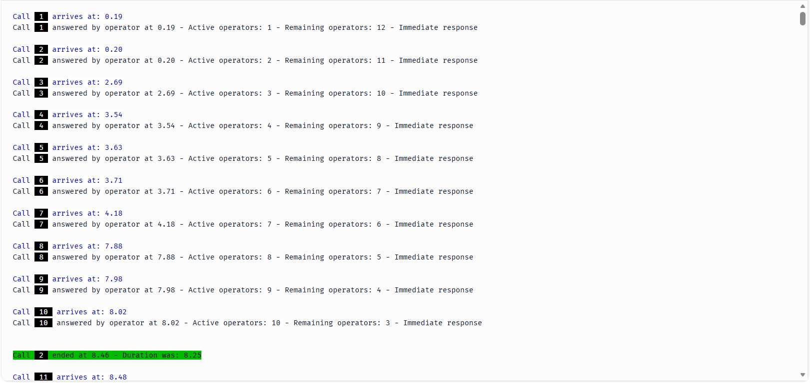
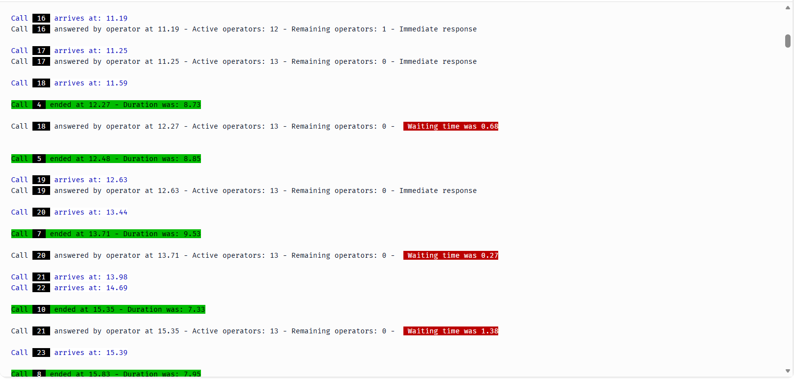

# About

This repository was created to follow lessons at Simpy course by The Open Science Nerd - Tom Monks - available at https://youtube.com/playlist?list=PLrOeiVQ0eMwF6qE5RLs2brgxBfVUy3MO3&amp;si=Qjb9B127BUNknk2_. While most of the text contained in the notebooks are from The Open Science Nerd original notebooks, code might present some changes by myself during the learning path. One such reason of differences is the usage of a reactive notebook like marimo that imposes constraints on how variables are named, for example.

Code from the Simpy course is available at https://github.com/pythonhealthdatascience/intro-open-sim

# Part 1

Video 1 (of a total of 11) focus on laying down the basics of random number generation that is necessary to kick start the use of Simpy for discrete event simulations. It is covered in it:

- Pseudo-random number generators in Numpy
- Sampling procedure
- Sampling single values
- SeedSequence

Reference: [Code your first discrete-event simulation in Python. Part 1: Random sampling](https://www.youtube.com/watch?v=wn_zIG4fd6I)

# Part 2 & 3

Videos 2 and 3 covers the basics of Simpy - from creating a deterministic simulation of a call center to initial random simulation of a call center with a pool of operators.

I modified the output of part 3 with colored library (https://pypi.org/project/colored/) to pretty print the console output to enable quicker inspection of results.

**Figure 1**: First calls to arrive at call center

**Figure 2**: Saturation of calls at call center

References:

- [SimPy Basics | Code your first DES PART2](https://www.youtube.com/watch?v=FZOnGolWgho)
- [SimPy Resources and Service Processes | Code your first DES PART 3](https://www.youtube.com/watch?v=zyWo8ZT80fk)
